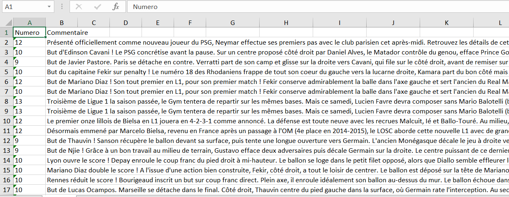
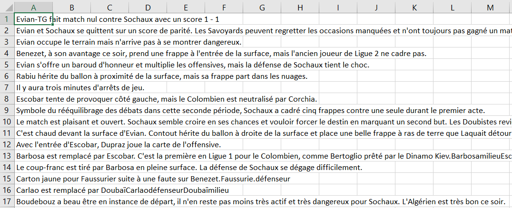

# Sentence_Classification_for_PGN

*When trying to use the Pointer Generator with a personal dataset, you might find difficult to find a large enough dataset to make a your own experiments. To resolve this issue and to be able to have relatively good results with a smaller dataset, we propose to filter the input sentences to erase unimoortant sentences, reducing the noise and the useless entropy of the input sentences. By doing so, the model will be able to learn more easily.*

This technique is usable only for summarization with a small entropy of information in both the sentences and the abstracts.

That is why I propose a sentence Classification model in Tensorflow 2.0, to create a raw dataset for the Pointer Generator Network.

You will need two datasets to achieve this task:

-One annotated dataset of about 500 sentences to learn how to classify your sentences

-One dataset of raw texts to classify and filter to create a smaller and filtered datasets, without unimportant sentences

*The datasets must be in the xlsx format*

Here is the format of the input file for the sentence selection:

One column for the class and one for the sentences. In our example, the class 17 is the class "non-important" and the sentences belonging to this class won't be added to the raw dataset of the PGN.

Here is the format of the sentences to be classified and filtered for the creation of the dataset of the PGN:

One column for the sentences to filter.
